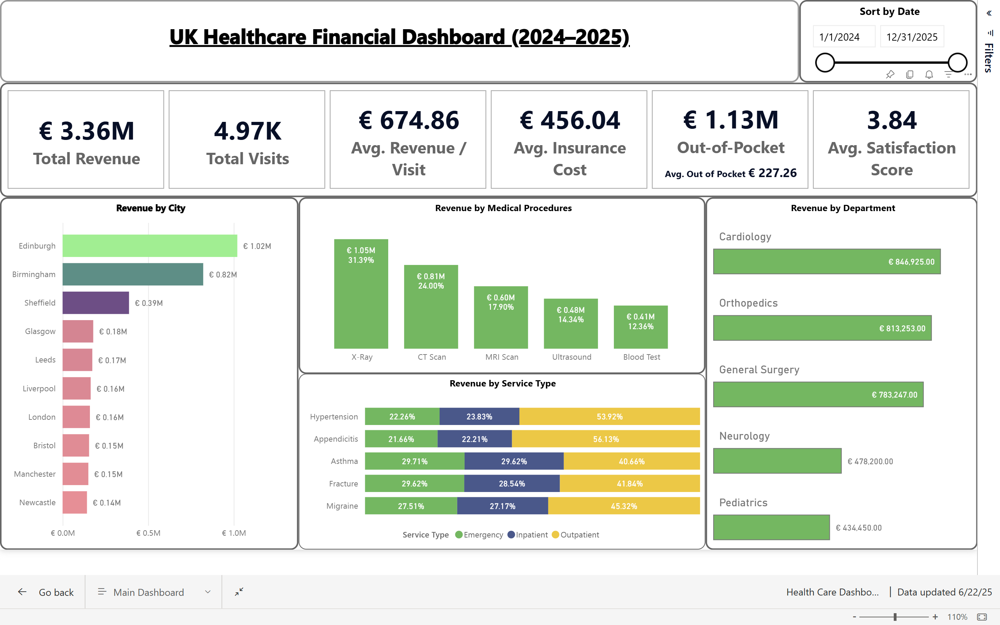

# 🏥 UK Healthcare Financial Dashboard (2024–2025) – Power BI

## 📊 Overview
This Power BI project presents an interactive financial and operational dashboard designed for the UK healthcare sector. It offers a consolidated view of revenue streams, cost metrics, patient visits, and satisfaction scores across multiple cities, procedures, and departments.

The dashboard supports data-driven decision-making by enabling stakeholders to monitor performance, identify patterns, and allocate resources more effectively.

---

## 📷 Dashboard Preview

📌 This dashboard enables hospital management to monitor performance by location, treatment type, and cost—providing visibility into both operational and financial aspects of care delivery.

---

## 🎯 Project Objectives

✅ Analyze patient visits, revenue, and insurance coverage  
✅ Track average cost per visit and out-of-pocket expenses  
✅ Visualize performance across cities, departments, and procedures  
✅ Provide actionable insights via dynamic Power BI visuals  
✅ Enhance business intelligence using slicers, KPIs, and charts

---

## 📂 Data & Tools Used

| Category       | Details                                        |
|----------------|------------------------------------------------|
| 📁 Dataset     | Mock UK hospital data (visits, costs, services) |
| 🛠 BI Tool     | Power BI (DAX, data model, visualizations)      |
| 🧠 Language    | SQL for ETL and data prep (optional)            |
| 📐 Visuals     | KPI cards, stacked bars, slicers, date filter   |
| 💾 Format      | `.pbix`, `.csv`, `.png`                         |

---

## 🚀 Key Features & Insights

### 1️⃣ Executive Summary KPIs
- €3.36M Total Revenue  
- 4.97K Total Visits  
- €674.86 Avg. Revenue per Visit  
- €456.04 Avg. Insurance Cost  
- €1.13M Out-of-Pocket  
- 3.84 Avg. Satisfaction Score  

### 2️⃣ Revenue Analysis
- **By City**: Edinburgh, Birmingham, Sheffield, etc.  
- **By Medical Procedure**: X-Ray, CT, MRI, Ultrasound, Blood Test  
- **By Service Type**: Emergency, Inpatient, Outpatient  
- **By Department**: Cardiology, Orthopedics, Surgery, Neurology

### 3️⃣ Dynamic Filters
- Interactive **date range slicer**  
- Filter visuals by multiple fields for custom reporting  

---

## 💡 How to Use

1. Open the `.pbix` file in Power BI Desktop  
2. Review mock data or replace it with real patient visit data  
3. Interact with the dashboard using slicers and filters  
4. Publish to Power BI Service if you'd like to share the report online

---

## 📌 Use Cases

- Executive dashboards for healthcare providers  
- Business intelligence reporting for hospitals  
- Portfolio projects for aspiring data analysts  
- Academic healthcare case studies and reporting demos

---

